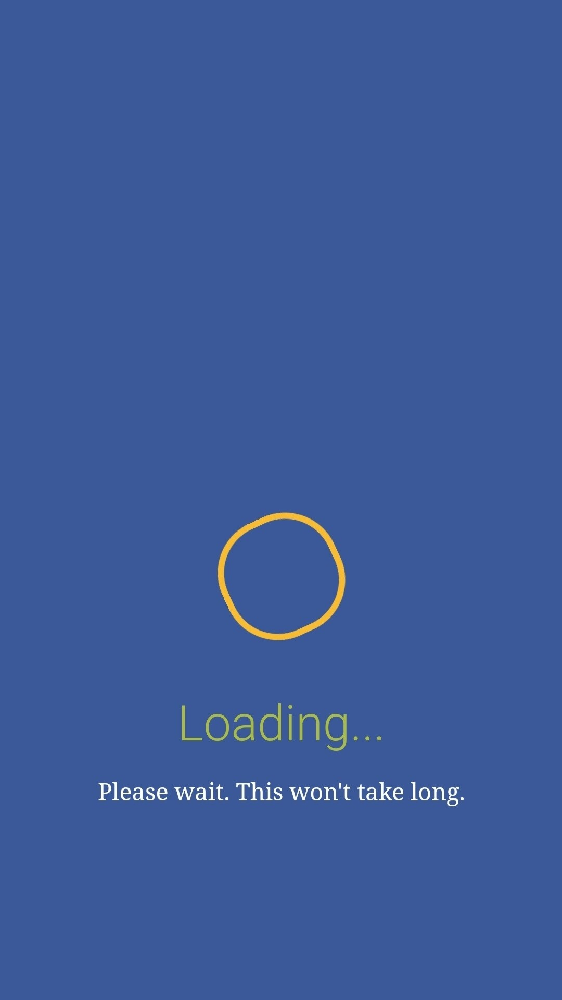

# Better_Google

[filter-google-result](https://github.com/imyangyong/filter-google-result) 에서 포크됨

## 설명

요즘 구글 검색을 하면 광고사이트로 리다이랙션되는 사이트가 너무 많이 보인다. 광고차단 프로그램으로 실제 접속까진 차단할 수 있으나 내가 원하는건 검색결과에서 이러한 악질 사이트를 없애버리는 것이다. 그래서 링크 데이터 기반 구글 검색결과 필터링 익스텐션을 만들게 되었다.
 
 
제발 구글링 좀 편하게 하자...

## 링크 추가
issue에 올려두면 확인 후 추가하겠음!

## DB 업데이트는?
귀찮아서 인터넷에서 받아오게 안함. 크롬 스토어에 업로드 하지 않는 이상 새 버전 나오면 직접 깔아야 할듯?